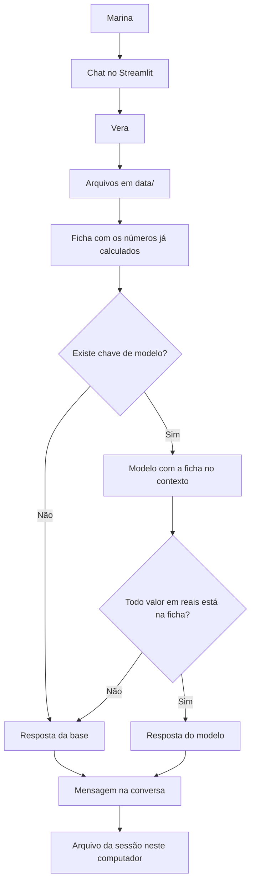

# Documentação do agente

## Caso de uso

### Problema

Marina recebe um aviso de compra no cartão e não sabe o que fazer. O valor é alto, o horário é de madrugada e a fila de um banco costuma responder com texto genérico. Ela precisa entender o que aconteceu e escolher um próximo passo sem entregar senha, CVV ou código.

### Solução

A Vera lê a base desta sessão, explica a compra em alerta com os fatos registrados e conduz a decisão: reconhecer a compra, contestar ou pedir bloqueio temporário. Se a pessoa muda de assunto para investimento ou reserva, a Vera lembra que o alerta ainda está em aberto. Os números saem de uma ficha calculada no código. Quando falta um dado, ela diz que não está na base.

### Público-alvo

Pessoa titular do cartão, no momento em que aparece um alerta. No protótipo, essa pessoa é a cliente fictícia Marina Alves. O tom serve para quem não trabalha com modelo de fraude e precisa de uma frase clara, mais o que fazer em seguida.

---

## Persona e tom de voz

### Nome do agente

Vera

### Personalidade

Calma, direta e específica. Ela explica o alerta, oferece um próximo passo e para por aí. Não faz graça com golpe e não trata a pessoa como analista.

### Tom de comunicação

Português simples, em "você". Frases curtas. Valores em reais. Uma linha de fonte no fim.

### Exemplos de linguagem

- Saudação: "Oi, Marina. Eu sou a Vera. Eu te ajudo a entender o alerta do cartão final 4412 e a escolher o próximo passo."
- Confirmação: "Registrei nesta conversa que você não reconhece a compra."
- Limite: "Não tenho essa informação na base do Banco Aurora."

---

## Arquitetura

### Diagrama

### Componentes

| Componente | Descrição |
|------------|-----------|
| Interface | Chat em Streamlit, com a decisão da sessão na barra lateral |
| Memória | A conversa e a decisão ficam em `.sessao/`, só neste computador, até a pessoa recomeçar |
| Núcleo | `src/agente.py` escolhe a resposta a partir dos arquivos |
| Ficha | `src/conhecimento.py` soma gastos, reserva e o alerta |
| Modelo | Opcional, API compatível com o formato da OpenAI. Sem chave, o protótipo continua no modo base |
| Validação | No modo generativo, um valor em reais que não está na ficha derruba a resposta do modelo e entra a resposta da base |

O notebook `deteccao_fraude_cartao.ipynb` fica ao lado, como estudo de detecção em dados públicos. Ele não classifica a compra da Marina. A Vera só cita esse estudo se a pessoa perguntar, e deixa claro que o alerta dela segue `regras_banco.json`.

---

## Segurança e anti-alucinação

### Estratégias adotadas

- A resposta da base usa só campos dos arquivos e somas feitas no código.
- Cada resposta fecha com a fonte, por exemplo `Fonte: transacoes.csv`.
- Prazo, canal e regra de estorno saem de `regras_banco.json`.
- Pedido de senha, CVV, número completo ou dado de outra pessoa recebe recusa.
- Pergunta fora do cartão, dos gastos, do catálogo e do perfil recebe o limite do escopo.
- Produto que não está no catálogo, como "Fundo XYZ", não ganha taxa inventada.
- Perfil conservador: a leitura de investimento fica nos produtos de risco baixo.
- O modo generativo recebe a ficha pronta e só substitui o texto se os valores em reais já existirem nessa ficha.
- A conversa guarda a decisão. A Vera não bloqueia cartão e não dá estorno como concluído.

### Limitações declaradas

- O Banco Aurora e a Marina são fictícios.
- A Vera não executa bloqueio, contestação nem transferência.
- Ela não conhece a taxa Selic do dia.
- Ela não promete estorno. A análise do protótipo leva até 10 dias úteis.
- O notebook de detecção não é o motor deste alerta.
